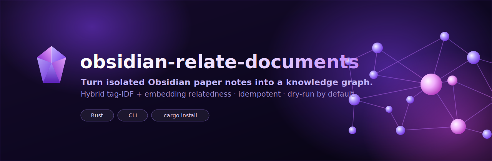

<p align="center">
  
</p>

# rs-obsidian-relate-documents

Compute `related-documents` Obsidian wiki-links for paper-report notes and
idempotently write them into each note's YAML frontmatter.

Idiomatic Rust port of `relate_reports.py` — it reproduces that script's
behavior exactly (hybrid IDF tag/author cosine + OpenAI embedding cosine with a
B-veto, full frontmatter reconstruction, protected files, dry-run by default).

---

## Table of contents

- [Purpose](#purpose)
- [Prerequisites](#prerequisites)
- [Configuration & resolution order](#configuration--resolution-order)
- [Installation / Release](#installation--release)
- [Usage workflow](#usage-workflow)
- [CLI flags](#cli-flags)
- [Algorithm (Phase A / Phase B / B-veto)](#algorithm-phase-a--phase-b--b-veto)
- [Frontmatter reconstruction & idempotency](#frontmatter-reconstruction--idempotency)
- [Protected files](#protected-files)
- [One-time first-run embedding cost](#one-time-first-run-embedding-cost)
- [File locations](#file-locations)
- [Build & test](#build--test)

---

## Purpose

Given a set of Obsidian paper-report notes under
`<reports-rel>/{<folders>}/` inside your vault, compute for each note a
curated, symmetric set of "related documents" links and write them into the
note's `related-documents:` YAML frontmatter property.

Nothing about a specific vault, machine, or user is compiled into the binary.
All machine/vault-specific values are supplied at runtime via CLI flags or
environment variables (see [Configuration](#configuration--resolution-order)).

## Prerequisites

1. **Rust toolchain** (edition 2021; built/tested with cargo 1.94).
2. **`OPENAI_API_KEY`** exported in the environment — required for Phase B
   (the `text-embedding-3-small` embeddings call).
3. **A vault root** — supplied via `--vault-root` or the
   `OBSIDIAN_VAULT_ROOT` environment variable. There is **no default**; the
   tool exits with an error if neither is provided.
4. **`obsidian-paper-cache` DB built and current**: the cache DB (default
   `$HOME/.cache/obsidian-paper-cache/papers.db`, override with `--db-path`)
   must exist and reflect the vault. Rebuild it
   (`obsidian-paper-cache build`) whenever notes are added/renamed, otherwise
   newly added notes are skipped (kept `related-documents: []`) and renamed
   notes leave stale rows (these are auto-excluded — see
   [Protected files](#protected-files)).

## Configuration & resolution order

| Setting        | Flag             | Env / fallback                     | Default                                          |
|----------------|------------------|------------------------------------|--------------------------------------------------|
| Vault root     | `--vault-root`   | `OBSIDIAN_VAULT_ROOT`              | **none — required (hard error if unset)**        |
| Reports dir    | `--reports-rel`  | —                                  | `研究/98_論文レポート`                            |
| Folders        | `--folders`      | —                                  | `00-General`, `01-Simulation`, `02-Security`     |
| Protected      | `--protected`    | —                                  | *(empty — no protected notes)*                   |
| Cache dir      | `--cache-dir`    | —                                  | system temp dir (`std::env::temp_dir()`)         |
| Cache DB       | `--db-path`      | —                                  | `$HOME/.cache/obsidian-paper-cache/papers.db`    |

Resolution rules:

- **Vault root**: `--vault-root` wins; otherwise `OBSIDIAN_VAULT_ROOT`;
  otherwise the program exits with
  `vault root required: pass --vault-root or set OBSIDIAN_VAULT_ROOT`.
- **`--reports-rel`**: a path relative to the vault root. The reports
  directory is `<vault-root>/<reports-rel>`.
- **`--folders`**: repeatable (`--folders 00-General --folders 02-Security`).
  If the flag is omitted entirely, the three defaults above are used. If you
  pass it at least once, only the folders you pass are used.
- **`--protected`**: repeatable. Each value is a path relative to
  `<reports-rel>` (e.g. `02-Security/Some Note.md`). Protected notes are never
  written but may still be link targets from other notes. Default = empty.
- **`--cache-dir`**: directory holding the embedding cache
  (`relate_emb_cache_rs.bin`) and the edge-decision dump
  (`relate_edges_rs.json`). It is created if missing. Default = the system
  temp directory.
- **`--db-path`**: full path to the `obsidian-paper-cache` SQLite DB. Default
  is `$HOME`-derived as shown above.

Set the vault root once in your shell so you do not have to pass it every run:

```bash
export OBSIDIAN_VAULT_ROOT="$HOME/Documents/Obsidian"   # adjust to your vault
```

## Installation / Release

The release mechanism for this CLI is `cargo install`, which compiles an
optimized binary and places it on `~/.cargo/bin` (ensure that directory is on
your `PATH`). **Do not** `cargo publish` it to crates.io.

### Install (first time)

```bash
cargo install --path .
```

(Run from a checkout of this repository.) The crate/package is named
`rs-obsidian-relate-documents`, but the installed command is
**`obsidian-relate-documents`** (the binary name is set via `[[bin]]` in
`Cargo.toml`). It is built with the `[profile.release]` settings
(`opt-level = 3`, `lto = true`). Verify:

```bash
which obsidian-relate-documents      # -> ~/.cargo/bin/obsidian-relate-documents
obsidian-relate-documents --help
obsidian-relate-documents --version  # prints the Cargo.toml version
```

If `obsidian-relate-documents` is not found, add Cargo's bin dir to `PATH`
(zsh):

```bash
echo 'export PATH="$HOME/.cargo/bin:$PATH"' >> ~/.zshrc && source ~/.zshrc
```

### Release a new version (upgrade an existing install)

1. Make your code changes.
2. Bump `version` in `Cargo.toml` (e.g. `0.1.0` → `0.2.0`) — this is the value
   printed by `--version` and is how you tell installed releases apart.
3. Reinstall over the previous binary with `--force`:

```bash
cargo install --path . --force
obsidian-relate-documents --version   # confirm the new version
```

`--force` (alias `-f`) is required because the command already exists; without
it `cargo install` refuses to overwrite. Add `--locked` to install exactly the
versions pinned in `Cargo.lock` for a reproducible release build:

```bash
cargo install --path . --force --locked
```

### Optional: change the command name

The binary name is decoupled from the crate name via the `[[bin]]` table in
`Cargo.toml`:

```toml
[[bin]]
name = "obsidian-relate-documents"
path = "src/main.rs"
```

Edit `name` (e.g. to `obsidian-relate-docs`) and reinstall to install under a
different command. (Alternatively, just add a shell alias.)

### Uninstall

`cargo uninstall` takes the **package** name (`rs-obsidian-relate-documents`),
not the binary name:

```bash
cargo uninstall rs-obsidian-relate-documents
```

This removes the installed binary from `~/.cargo/bin`; it does not touch the
vault, the cache DB, or the embedding cache.

## Usage workflow

The tool is **dry-run by default** — it never writes the vault unless `--apply`
is passed. Set the vault root once, then:

```bash
# 0. (once per shell) tell the tool where your vault is
export OBSIDIAN_VAULT_ROOT="$HOME/Documents/Obsidian"   # adjust to your vault

# 1. (when notes changed) refresh the metadata cache
obsidian-paper-cache build

# 2. Dry-run: prints Phase A/B stats, merge decision breakdown, final-graph
#    integrity checks (asymmetric/dead/self-link must all be 0), and 20
#    seeded sample papers. No files touched.
obsidian-relate-documents

# 3. Inspect the samples / edge dump (<cache-dir>/relate_edges_rs.json) and,
#    if you want to tune how aggressively tag-only ("A") edges are vetoed:
obsidian-relate-documents --a-veto-cos 0.45

# 4. Apply: idempotently rewrite the related-documents block of every report
#    (protected/manual notes skipped; only changed files rewritten).
obsidian-relate-documents --apply

# 5. Re-running --apply is safe and free: full reconstruction makes it
#    idempotent, and embeddings are served from the on-disk cache.
obsidian-relate-documents --apply
```

You can also pass the vault root explicitly instead of exporting it:

```bash
obsidian-relate-documents --vault-root "$HOME/Documents/Obsidian"
```

Curate notes that should never be auto-written (still valid as link targets):

```bash
obsidian-relate-documents \
  --protected "02-Security/Some Manually Curated Note.md" \
  --protected "00-General/Another Hand-Maintained Note.md"
```

Fast iteration without paying for the full corpus embedding:

```bash
obsidian-relate-documents --limit-embed 50      # embed only first 50
```

## CLI flags

```
obsidian-relate-documents [OPTIONS]

  --apply                Write changes to disk (default: DRY-RUN, no files touched)
  --limit-embed <N>      Embed only the first N papers (testing; reduces API cost)
  --a-veto-cos <F>       An A-only edge survives only if embedding cosine >= F [default: 0.4]
  --seed <SEED>          Random seed for the 20-sample selection [default: 42]
  --vault-root <PATH>    Vault root on disk. Required: this flag or env OBSIDIAN_VAULT_ROOT
  --reports-rel <STR>    Reports directory, relative to the vault root [default: 研究/98_論文レポート]
  --folders <NAME>       Report sub-folder to include (repeatable) [default: 00-General, 01-Simulation, 02-Security]
  --protected <RELPATH>  Protected relpath relative to <reports-rel> (repeatable): never written, but may still be a link target [default: none]
  --cache-dir <DIR>      Directory for the embedding cache + edge dump [default: system temp dir]
  --db-path <PATH>       Cache DB path [default: $HOME/.cache/obsidian-paper-cache/papers.db]
  -h, --help             Print help
  -V, --version          Print version
```

**Dry-run by default:** without `--apply` no files are written; the tool prints
the full analysis (Phase A/B stats, merge edge-decision breakdown, final graph
checks, and 20 seeded sample papers) and exits without touching the vault.

## Algorithm (Phase A / Phase B / B-veto)

Relatedness is computed in two phases and then merged:

**Phase A — IDF-weighted tag/author cosine (recall widener).**
For each paper a term set is built from namespaced tags
(`Survey/ Method/ Concept/ Dataset/ FoS/Primary/ FoS/Second/ FoS/Secondary/
Venue/`, excluding `学術論文` and the `Year/ Lang/ Cite/ Type/` namespaces)
plus one `author::<name>` term per author. Terms are IDF-weighted
(`idf = max(0, ln(N / df))`; a term in every document drops to 0). Cosine
similarity is computed over an inverted index. A pair is an A-candidate iff
cosine ≥ 0.30 **and** the pair shares at least one "specific" term
(document frequency ≤ 200). Each node keeps its top 8 candidates by cosine.

**Phase B — OpenAI embedding cosine (ranking signal).**
The note's `要約` (summary) section (or a fallback of the whole body) plus the
title is embedded with `text-embedding-3-small`. Vectors are L2-normalized.
Each node keeps up to 8 neighbors with embedding cosine ≥ 0.55.

**Merge with B-veto.**
Every candidate pair (from A or B) is decided by its embedding cosine `ec`:

| condition                             | decision | source     |
|---------------------------------------|----------|------------|
| no embedding on either endpoint       | drop     | —          |
| `ec >= 0.55`                          | keep     | `AB` / `B` |
| A-edge and `ec >= a_veto_cos` (0.40)  | keep     | `A`        |
| A-edge and `ec <  a_veto_cos`         | drop     | veto-A     |
| B-candidate and `ec < 0.55`           | drop     | below-B    |

The **ranking weight of every kept edge is the embedding cosine, uniformly** —
Phase A only widens recall and never dominates ranking. The merged graph keeps
each node's top 8 incident edges (reciprocity is automatic because pairs are
unordered), then enforces a hard degree cap of 10 by iteratively removing the
globally weakest incident edge of any over-degree node from both endpoints
(symmetry preserved). Each node's neighbor list is finally sorted by weight
descending.

## Frontmatter reconstruction & idempotency

Each run **fully reconstructs** the `related-documents:` block from scratch
(replacing any existing inline `[]` or block form, or appending it before the
closing `---` if absent). Because reconstruction is total, re-running the tool
on already-written files produces byte-identical output — it is **idempotent**.
Files are only rewritten when their content actually changes, via an atomic
temp-file + rename.

## Protected files

Relpaths passed via `--protected` (relative to `<reports-rel>`) are treated as
manually curated and are **never written** (counted separately as "protected
skipped"). They may still appear as link *targets* from other notes. By default
there are no protected files; you opt in per run, e.g.:

```bash
obsidian-relate-documents --protected "02-Security/Some Note.md"
```

Stale cache rows for renamed/deleted notes (a DB `file_path` that no longer
exists on disk) are excluded entirely — neither writers nor link targets — so
there are no mid-apply crashes or dead links.

## One-time first-run embedding cost

The Rust embedding cache is a separate file from the Python `.npz` cache and
the Python cache is **not** read. Therefore the **first** Rust run re-embeds
the entire corpus (~$0.02 on `text-embedding-3-small`, roughly 18 API calls
for the full corpus). Every subsequent run is free: identical embed inputs are
served from the content-hash cache at `<cache-dir>/relate_emb_cache_rs.bin`.

## File locations

- Cache DB (read): `--db-path`, default `$HOME/.cache/obsidian-paper-cache/papers.db`
- Vault root: `--vault-root` / `$OBSIDIAN_VAULT_ROOT` (required, no default)
- Reports: `<vault-root>/<reports-rel>/{<folders>}/`
  (defaults: `研究/98_論文レポート` and `00-General`,
  `01-Simulation`, `02-Security`)
- Embedding cache: `<cache-dir>/relate_emb_cache_rs.bin`
  (bincode `Vec<(sha256-hex, Vec<f32; 1536>)>`; separate from the Python npz)
- Edge-decision dump: `<cache-dir>/relate_edges_rs.json`
  (one object per candidate pair: `i, j, a_cos, emb_cos, is_a, is_b,
  decision, src`)

`<cache-dir>` defaults to the system temp directory and can be overridden with
`--cache-dir`.

## Build & test

```bash
cargo build --release
cargo clippy --all-targets -- -D warnings
cargo test
cargo run -- --help
```

Tests are pure (no network, DB, or real vault files) and cover configuration
resolution (vault-root required / env fallback / explicit overrides),
frontmatter reconstruction & idempotency, Phase-A IDF math, the target
resolver, `要約`-section extraction/cleaning, and the merge B-veto decision
table including reciprocity and the hard degree cap.
